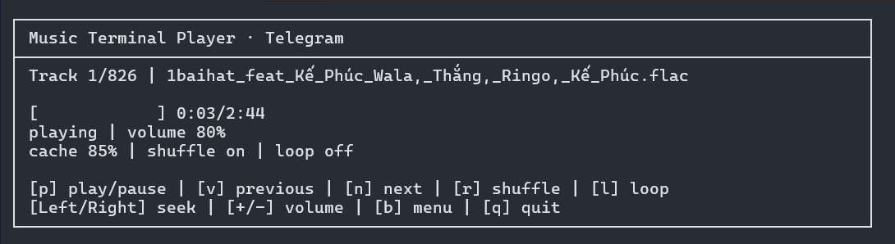

# Music Terminal Player

Lightweight, keyboard-driven terminal music player for Windows. Play local audio, stream synchronized Telegram public or private channels, manage playlists and queues, or stream YouTube audio through yt-dlp and FFmpeg.



## Why?

A small terminal player for local libraries and online sources without the overhead of a desktop music app. It keeps playback, queues, playlists, Telegram channels, and YouTube audio in one keyboard-driven interface. Inspired by [lowfi](https://github.com/talwat/lowfi).

## Features

- Local file and folder playback
- Telegram public- and private-channel synchronization, streaming, and offline download
- Combined multi-channel Telegram queues
- YouTube video and playlist audio streaming without saving complete media files
- YouTube seeking, 0.5x–2.0x speed control, and persistent per-category SponsorBlock auto-skip settings
- Windows media controls with track metadata and Play, Pause, Next, and Previous actions
- Automatic YouTube recovery when the default audio output changes
- Editable queues, playlists, shuffle, loop modes, and persistent volume
- Built-in offline English UI with optional, verified Vietnamese download and persistent selection
- Unicode-aware terminal panels, compact color-coded launcher actions, and queue columns
- Portable or custom yt-dlp and FFmpeg setup with manual portable tool updates
- Direct YouTube URL or playlist input from Quick play

## Installing
Windows is supported. macOS and Linux support are planned.

Windows binaries are available in the [releases](https://github.com/harrytien107/Music_Terminal_Player/releases/tag/v3.0.4)

## Tutorials

Don't know how to use? Start with the guide for the source you want to play:

- [Local music tutorial](docs/local-tutorial.md) — add a music folder, play saved folders, and use playback controls.
- [Telegram tutorial](docs/telegram-tutorial.md) — create API credentials, log in, synchronize channels, and stream or download music.
- [YouTube tutorial](docs/youtube-tutorial.md) — set up yt-dlp and FFmpeg, play videos or playlists, and update the tools.

### Playlist quick tutorial

1. Add a local folder or synchronize a Telegram channel first.
2. Open `Playlists` → `Create playlist`, enter a name, then choose `Local folder` or `Telegram channel`.
3. Select songs with `Ctrl+Space`; use `Ctrl+A` to select all matching songs, then press `Enter` to save.
4. Open `Playlists` again and select the playlist to play it. The same menu can edit songs, rename the playlist, or delete it.

## Supported extensions

`mp3`, `flac`, `wav`, `ogg`, `opus`, `m4a`, `aac`, `alac`, `aiff`, `webm`.

## Extra Flags

- `--borderless`: remove the classic Windows Console Host border and size the window for the player. Windows Terminal tabs are unchanged.
- `--help` / `-h`: print CLI usage and controls.

Example:

```
music-terminal-player.exe --borderless
```

## Documentation

See the [usage guide](docs/usage.md) for CLI commands, queues, playlists, language packs, data files, and current limitations.